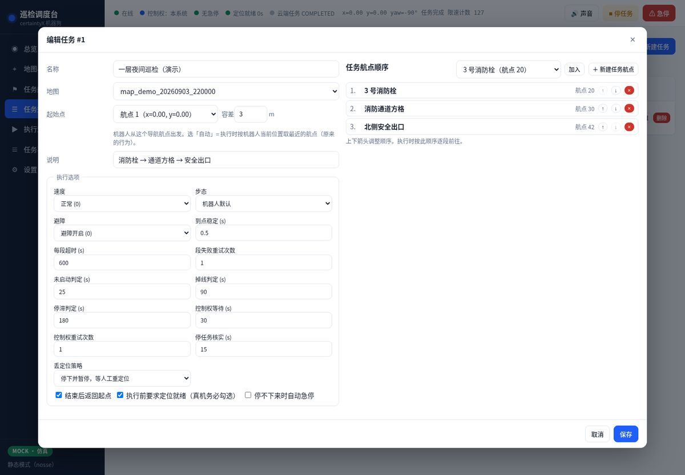
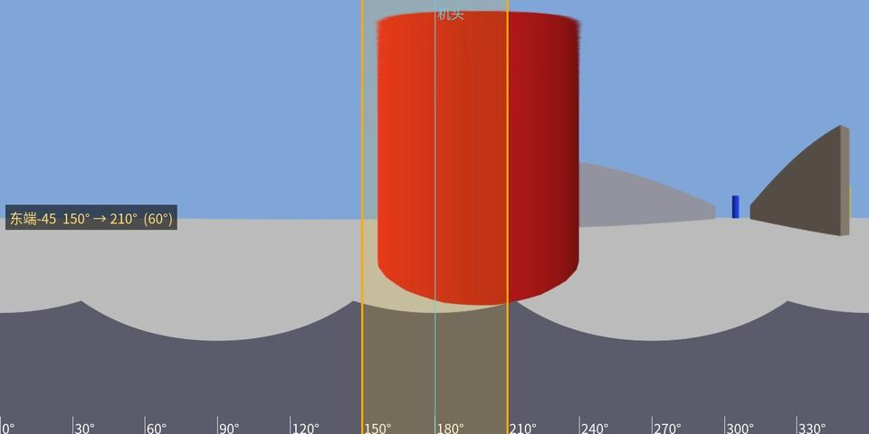
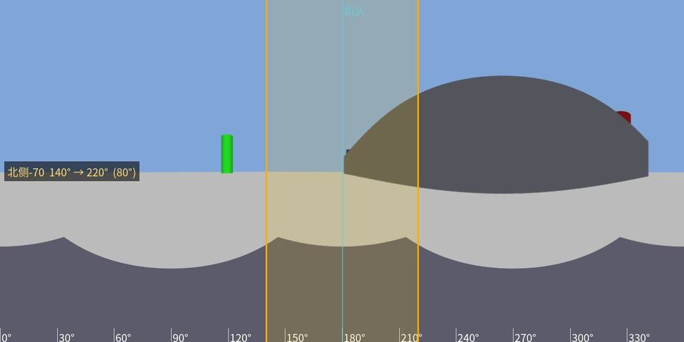
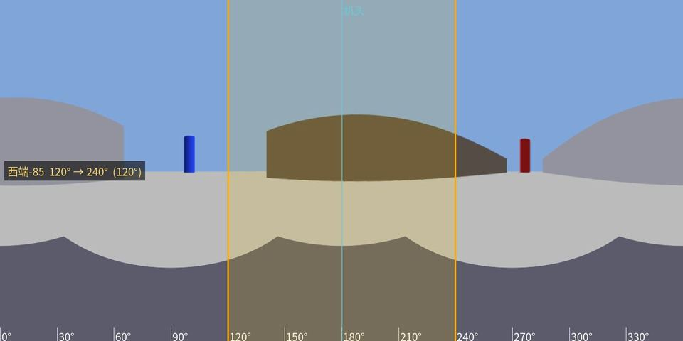
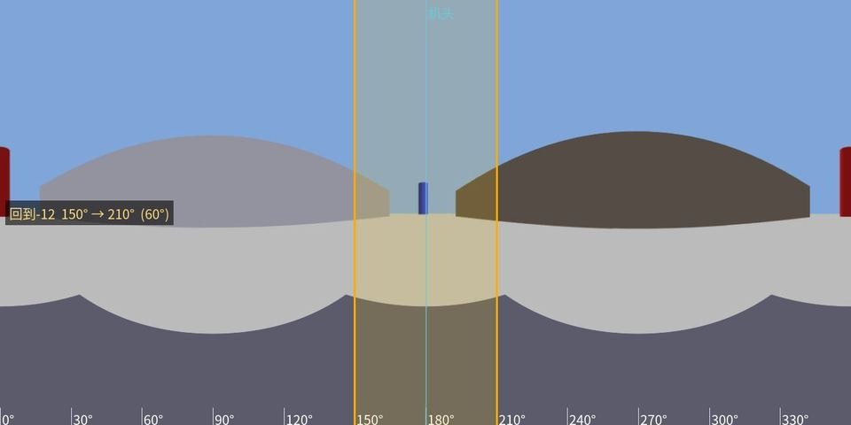
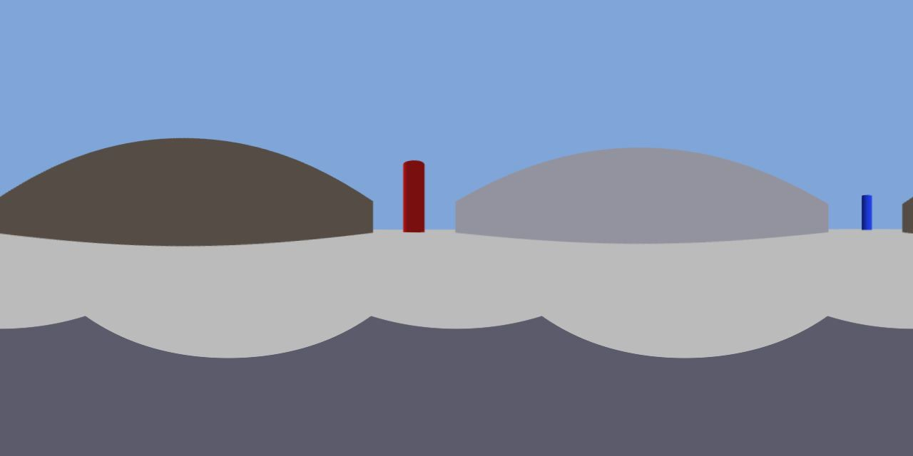

# 界面截图

仿真模式（MOCK）下用无头 Chrome 1440×1000 截取、缩放到 1200 宽；数据是 `make seed` 那份演示数据（45 点演示地图、3 个任务航点、指定起始点为航点 1、跑完一趟并人工改判过一条）。截图随 UI 变化更新，最近一次：2026-09-07（v0.4.6）。

| 页面 | 图 | 看什么 |
|------|----|--------|
| 总览 |  | 五个状态灯与位姿；机器人卡片（**定位按 `received_at` 判断**，`Location` 只展示）；云端任务的语义字段；初始化三步；近 30 天按航点统计；实况画面 |
| 地图与导航航点 |  | 导航航点 + 邻接边 + 任务航点（橙色菱形）+ 机器人（蓝色箭头）+ 点云背景；连通块数；路线预览 |
| 任务航点 |  | 单表 CRUD：参考图缩略图、导航航点号、坐标、角度范围、prompt、期望回答 |
| 任务航点编辑器 |  | **全景角度编辑器**：两条可拖拽黄线圈出范围（支持跨接缝），蓝色虚线是机头方向；答案模版三句播报可试听；试问 VLM |
| 任务规划 |  | 任务列表：航点数、**起始点**、速度/步态/避障、定时、最近执行；执行 / 路线 / 定时 / 编辑 |
| 任务编辑器 |  | **起始点**（自动 或 指定导航航点 + 容差）、任务航点顺序、21 项执行选项（超时/重试/丢定位策略/停任务核实…） |
| 执行监控 |  | 分段进度（含幂等键与下发/到达时刻）、轨迹小地图、检查结果（带角度标注的全景 + 裁切 + 回答 + 播报 + **人工复核**按钮） |
| 执行监控（失败） |  | 第 1 段避障失败 `0x234B`、后续段中止；右上角「从某航点重跑剩余航点」 |
| 任务事件 |  | 云端 + 系统事件统一时间线，按来源/类型/级别/执行/关键字过滤，可导出 CSV |
| 设置 |  | 连接、VLM（mock/qwen/openai_compat/anthropic）、TTS 与汇出、抓图源、机头校准、系统自检、备份/迁移 |

## 真机（Gazebo）到点抓到的全景（带角度范围标注）

09-05 夜四点巡检时每个点抓到的原图，用来说明「圈范围」在真实画面上是什么效果。

| 航点 | 图 | 说明 |
|------|----|------|
| 45 东端 |  | 正前方紧挨着红色大圆柱；范围 150°–210° |
| 70 北侧 |  | 正前方棕色圆顶，左侧绿色圆柱，右后红圆柱；范围 140°–220° |
| 85 西端 |  | 正前方棕色圆顶，两侧灰色圆顶；范围 120°–240° |
| 12 起点 |  | 正前方远处小蓝圆柱；范围 150°–210° |
| 首帧样张 |  | 09-04 第一次真机抓帧（1280×640，2:1 等距投影） |

这几张里机器人前进方向上的物体都落在图像中心附近 → 那台 Gazebo 相机的零点就是机头（`FORWARD_DEG=180` 成立）。真狗的 Insta360 需要用「设置 → 机头校准」单独标定（用户在自己那台真机上标出的是 269.3°）。

重新生成：`make shots`（需要调度系统在跑；`?nosse=1` 静态模式避免无头浏览器被 SSE 长连接挂住）。
