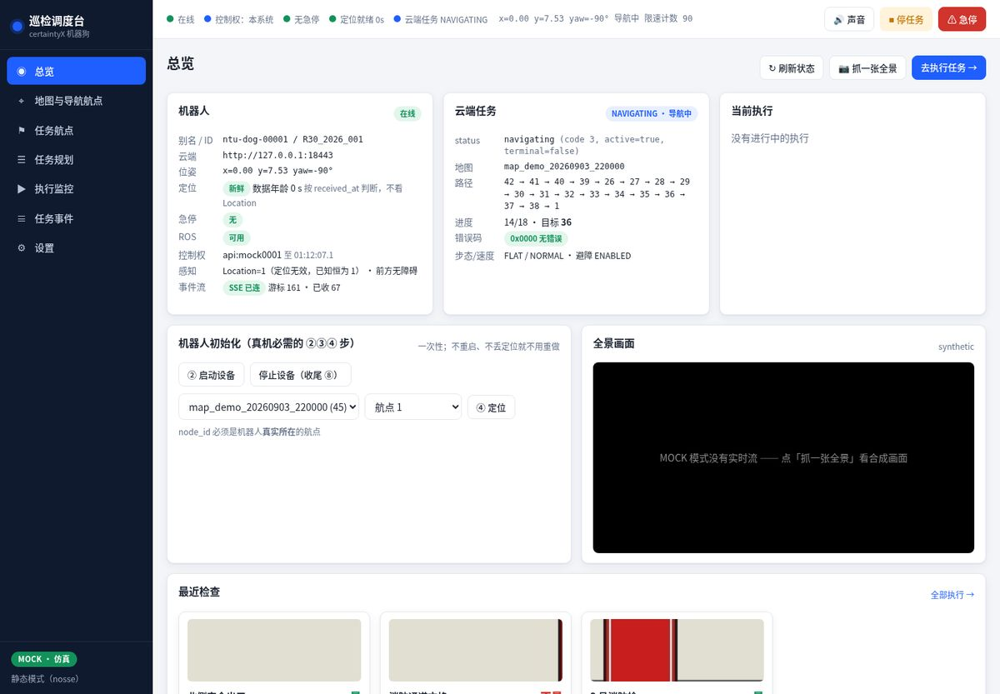
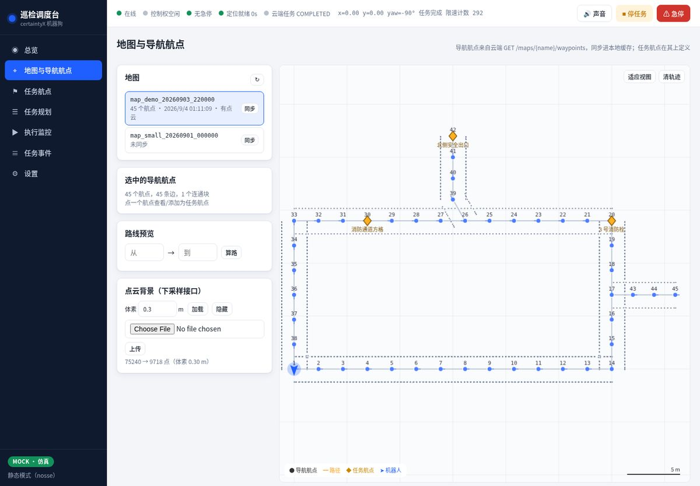
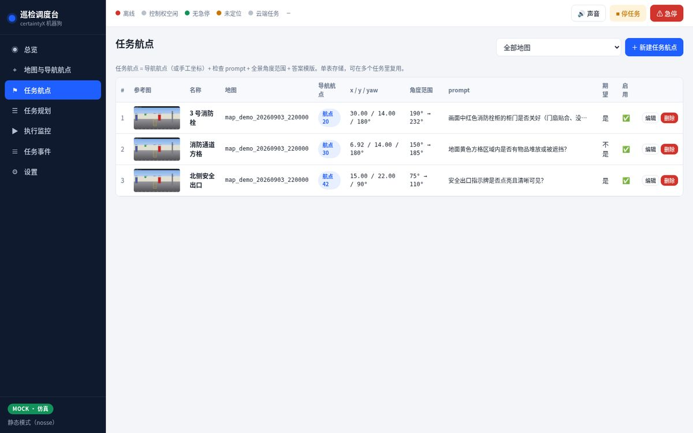
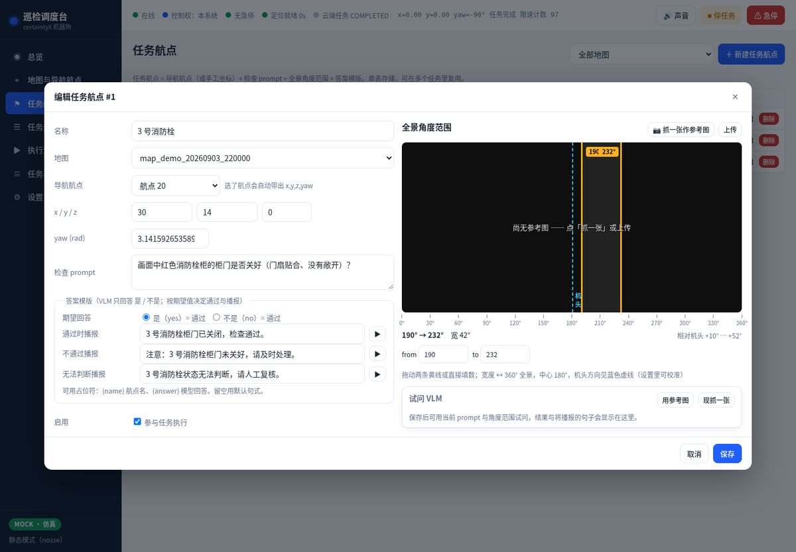
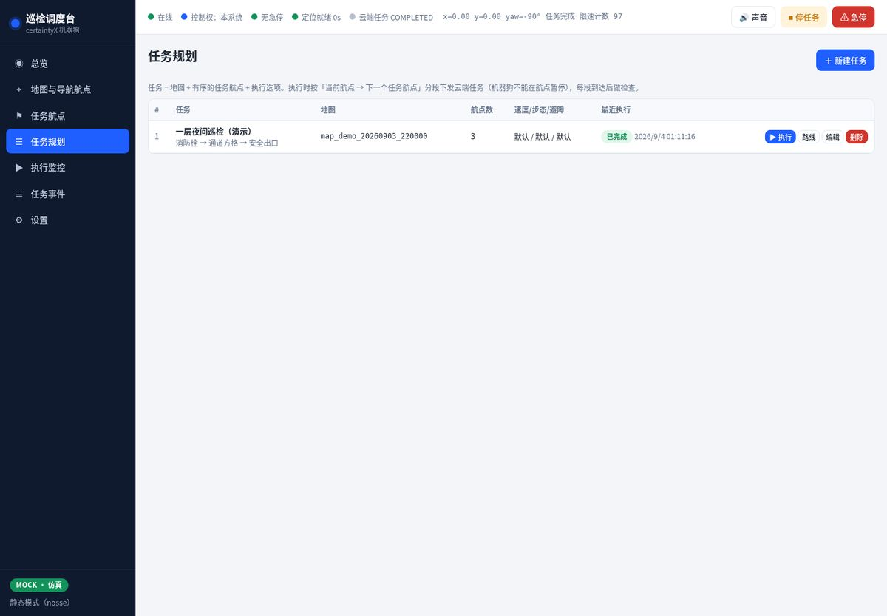
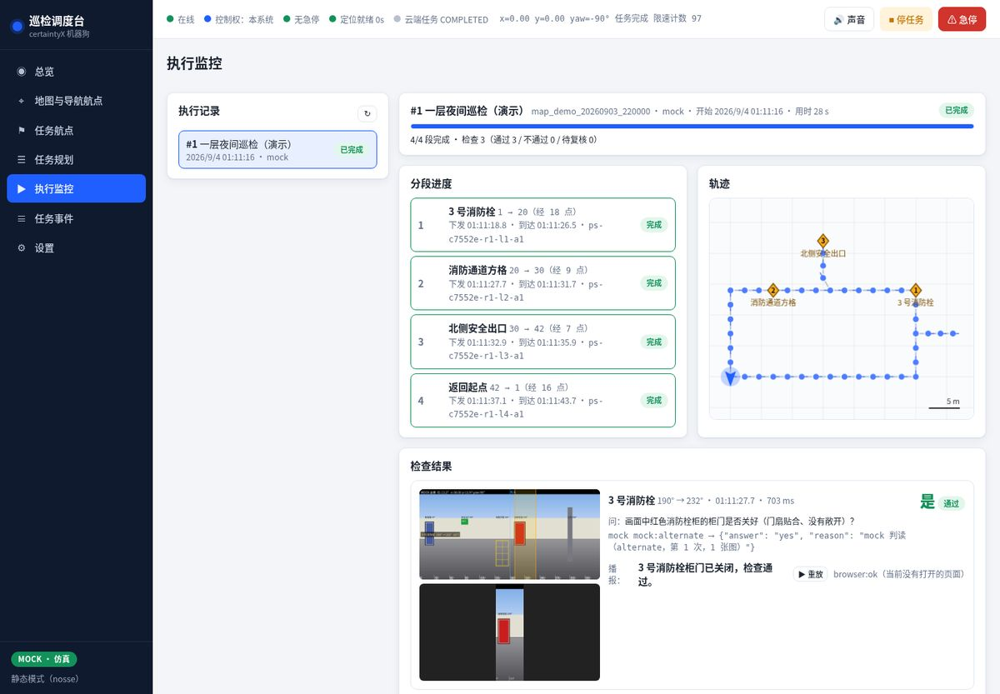
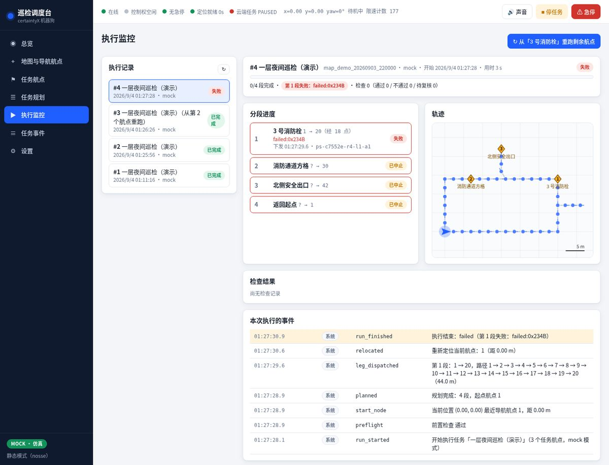
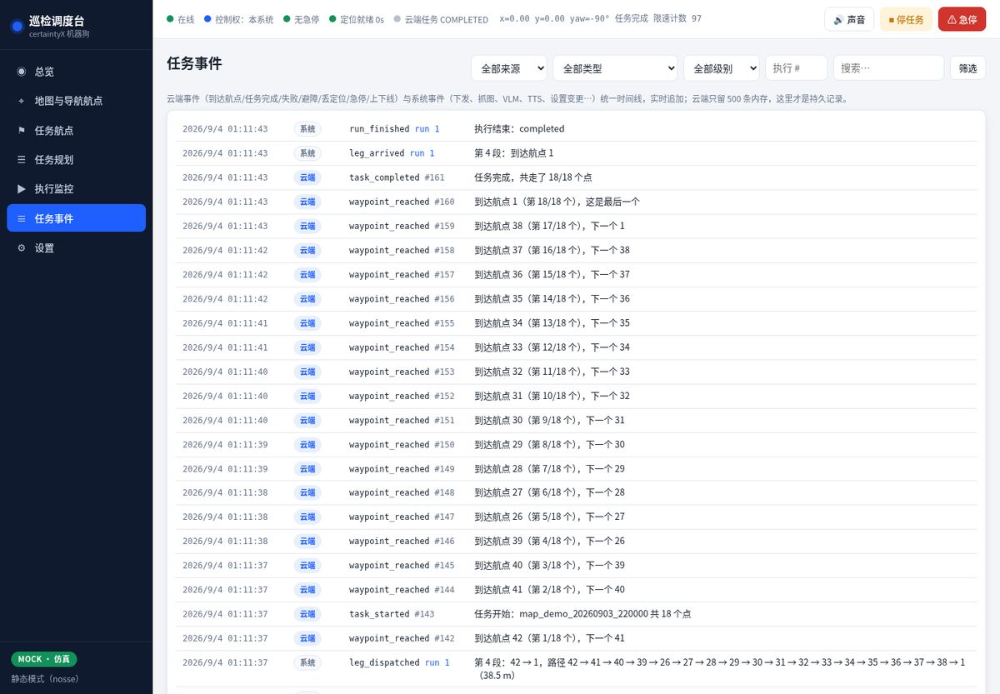
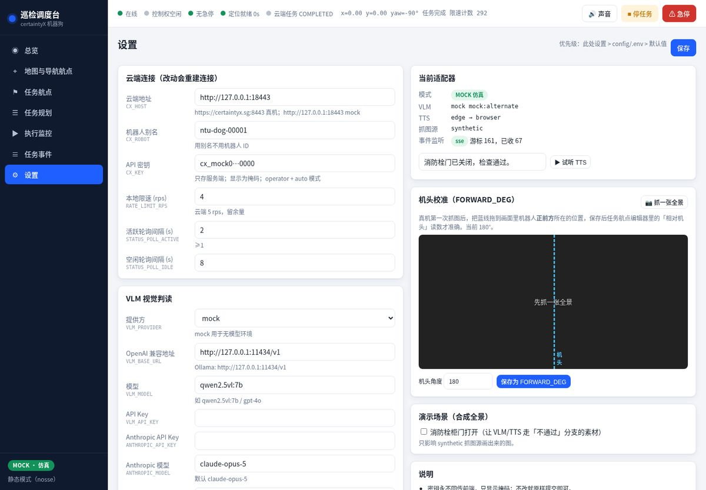

# 界面截图（mock 模式，无头 Chrome 1440×1000 缩放到 1200 宽）

| 页面 | 图 | 说明 |
|------|----|------|
| 总览 |  | 机器人卡片（定位按 received_at 判断）、云端任务语义字段、初始化三步、最近检查 |
| 地图与导航航点 |  | 导航航点 + 邻接边 + 任务航点（菱形）+ 机器人 + 点云背景（体素下采样） |
| 任务航点 |  | 单表 CRUD，参考图缩略图、角度范围、prompt、期望回答 |
| 任务航点编辑器 |  | 两条可拖拽黄线圈出全景角度范围，蓝色虚线为机头方向；答案模版三句播报可试听；试问 VLM |
| 任务规划 |  | 任务列表：执行 / 路线预览 / 编辑 / 删除 |
| 执行监控（完成） |  | 分段进度（幂等键、下发/到达时刻）、轨迹小地图、检查结果（带范围标注的全景 + 裁切 + 回答 + 播报） |
| 执行监控（失败） |  | 第 1 段避障失败 0x234B，后续段中止；右上角「从某航点重跑剩余航点」 |
| 任务事件 |  | 云端 + 系统事件统一时间线，可筛选、实时追加 |
| 设置 |  | 连接 / VLM / TTS / 抓图；机头校准；系统自检；演示场景开关 |
